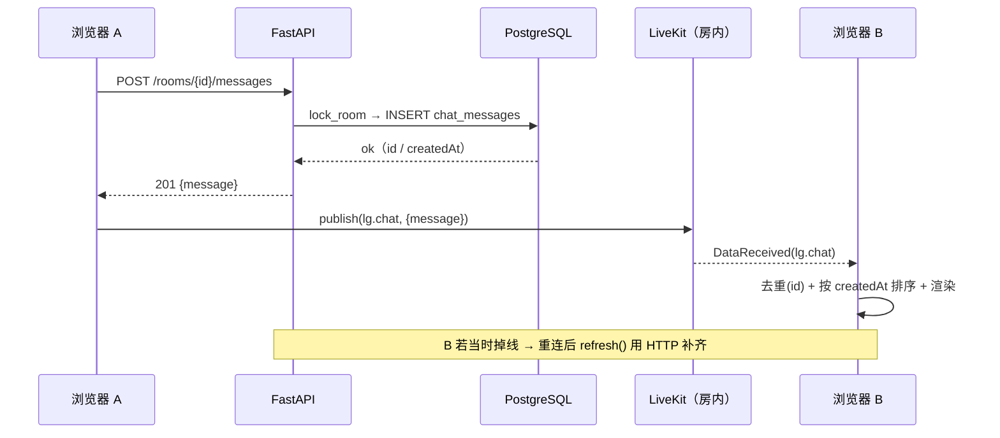

<!-- overview -->
本页是 r004（M3）对总设计 `docs/01-architecture/r001-app-architecture.md` 与 r002 增量 `r002-realtime-architecture.md` 的**增量**：只讲「房内新增四种能力的实时层怎么长」，事实细节在轮次设计 `docs/rounds/r004-room-extras/design.md` 与模块页。

## 1. 一句话架构

**HTTP 是真相源，Data Channel 是加速器。** 房内的四种新状态（消息 / 举手 / 焦点 / 共享）里，前三种都能在库里查到、能在刷新后恢复；共享是纯实时（LiveKit 轨道，不落库），它的「谁在共享」由 SDK 事件推导。

```
浏览器 A ──HTTP(写)──► FastAPI ──SQL──► PostgreSQL        ← 唯一真相
   │                                        ▲
   └──Data Channel(房内广播)──► LiveKit ─────┘  B 端读：HTTP 拉快照 + 广播增量合并
                                 │
浏览器 B ◄───────────────────────┘
```

## 2. 分层（在 r002 之上加一层）

| 层 | r002 有什么 | r004 加什么 |
| --- | --- | --- |
| 连接层 | `useRoomConnection`（连接状态机 / SDK 断开归因 / 重连） | 不变 |
| 传输层 | — | `useDataChannel`（topic 订阅/发布、JSON 编解码、可靠发送） |
| 业务状态层 | 在场（LiveKit 事件）、设备（`useLocalDeviceState`） | `useChatMessages`（库 + 增量）、`useHandRaise`（快照）、`useRoomFocus`（快照）、`useScreenShare`（轨道事件） |
| 界面层 | 舞台 / 抽屉 / 控制坞 | 抽屉双 tab、举手与共享按钮、焦点徽标、优先级派生 |

## 3. 四条时序

### 3.1 发消息（写走 HTTP，广播只做加速）



### 3.2 举手（快照收敛）

```
任何端：POST/DELETE /hand-raise(s) → 服务端返回全量 hands → 该端 publish(lg.hands, {at, hands})
其他端：收到后比较 at，新者覆盖本地（不做增量合并，避免乱序）
```

### 3.3 焦点（快照收敛 + 派生优先级）

```
房主/协管：POST /focus {userId|null} → 全量 focus → publish(lg.focus, {at, focus})
所有人：LiveStage 用 pickFocusTile(共享 > 手动焦点 > 说话者 > 自己) 派生焦点格
```

### 3.4 共享（纯实时 + 协作停止）

```
B：控制坞「共享屏幕」→ localParticipant.setScreenShareEnabled(true)（用户手势触发）
所有人：RoomEvent.TrackPublished(source=ScreenShare) → ownerId=B → 焦点格切到共享画面 + 徽标
房主想停：publish(lg.screen.stop{targetUserId:B}) → B 端自己 setScreenShareEnabled(false)
（服务端强停方案待实测，见 design §6.1）
```

## 4. 失败与降级

| 故障 | 现象 | 行为 |
| --- | --- | --- |
| Data Channel 丢包/乱序 | 某端少一条消息或短暂状态不一致 | 快照类由 `at` 覆盖收敛；消息类靠「重连/刷新 refresh()」补齐；**任何时刻刷新都与库一致** |
| 后端不可达 | 发消息失败 | 气泡标「发送失败」+ 可重发；不吞输入 |
| LiveKit 不可达 | 房间连不上 | 与 r002 一致：状态条 + 重连按钮；聊天仍可读（HTTP 拉历史可用） |
| 别人关掉标签页 | 举手/焦点仍在库中 | 举手是**瞬时状态**：靠 `refresh()` 与会话恢复清理（M5 的「断线恢复」可选优化） |
| 服务端不支持强停共享 | 停共享无效 | 降级为协作停止，文档如实写明（design §6.1） |

## 5. 与既有设计的关系

- **不推翻 r002**：实时在场仍以 LiveKit 为准（ADR-0011 条 1）；r004 只新增「业务状态」这一层的真相源规则（ADR-0013）。
- **不引新依赖、不改运行形态**：没有 WebSocket 服务，后端仍是无状态的 FastAPI（除 PG 外无共享状态）——多实例部署时 Data Channel 仍只在房内，不影响正确性。
- **为 M5 留口**：① 断线后举手/焦点恢复（库已有数据，接一个 `refresh()` 即可）② 聊天未读的跨页持久化（需要按人存 last_read_at）。

## 6. 验证锚点

| 断言 | 方式 |
| --- | --- |
| 刷新后与库一致 | 真机刷新 + SQL 对账（需求单 E9/E10） |
| 两浏览器状态一致 | 双浏览器实测（E8/E11/E12） |
| 优先级规则与演示一致 | E12 的共享中说话不夺焦点 + 文档 §7 |
| 无「只靠广播」的状态 | 代码审查：每个状态的初始来源都是 HTTP（`refresh()` 三拉） |
